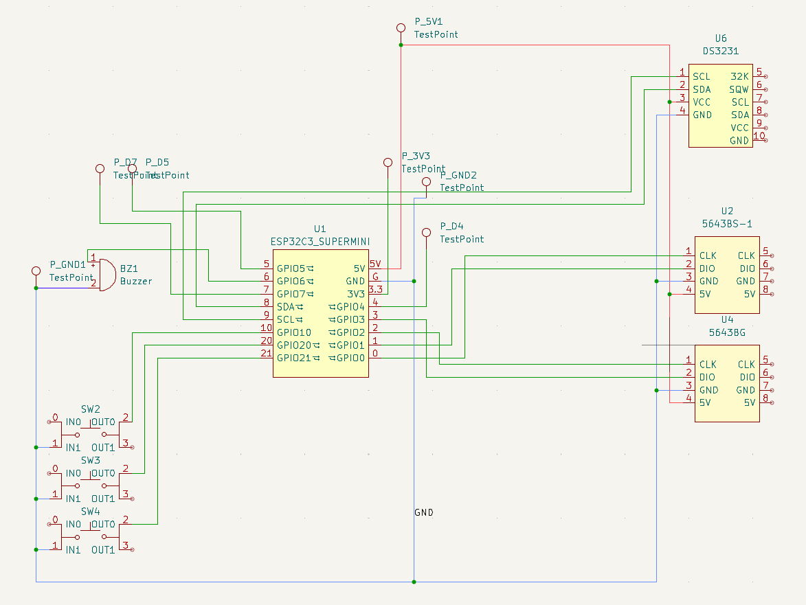

# Paxriel's Very Very Very Inefficient Clock

This is a 2x 4-digit 7-segment clock that is capable of the following features:

- Clock (Because its a clock)
- Stopwatch
- Timer
- Interval timer
- Brightness adjustment (Yes that's a feature now)

## Motivation

This was originally planned to be a retro-themed accessory for [LIFC 2025](https://www.littleislandfur.com/2025/) with a black and white theme to mimic the early digital radio clocks in the 80s. However, due to material limitations, this has converted into a early 2000s-ish transparent clock instead.

The main goal for the clock is to be:
- Stylish (Or as stylish as a retro clock can be)
- Portable (Either hung around the neck or on the wrist like a very ridiculously-sized watch)
- Useful even after the convention is over (i.e. convertible to desk clock)

## Software

This sketch requires the following in Arduino IDE to function properly:

### Board Manager

- ESP32 by Expressif

### Libraries

- ezButton by ArduinoGetStarted.com (v1.0.6)
- TonePitch by Rodrigo Dornelles (v1.0.3, actually this is originall planned cos I wanted a 2-buzzer setup but afterwards I found out that its a lot more complicated so out of the window it goes)
- Rtc by Makuna by Michael C. Miller (v2.5.0)
- TM1637 by Avishay Orpaz (v1.2.0)

## Electronics

This sketch runs on a ESP32 C3 Supermini as its base with the following components:
- DS3231 Module ([AliExpress](https://www.aliexpress.com/item/1005008494490890.html), the header pins, charging resistor and LED resistor are desoldered to allow it to work with a CR2032 battery)
- 2x 4-digit TM1637 7-segment display (1 red (5643BS-1), 1 green (5643BG)) ([AliExpress](https://www.aliexpress.com/item/1005001582129952.html))
- 3x Push-buttons ([AliExpress](https://www.aliexpress.com/item/1005008340384363.html))
- 1x Buzzer ([AliExpress](https://www.aliexpress.com/item/1005008483688535.html))

After breadboarding, this is converted to a [PCB](./gerbers/) using KiCad and sent for printing at [JLCPCB](https://jlcpcb.com/).

This board can be powered either by plugging in the USB-C port in the ESP32 C3 Supermini using a computer or power bank, or it can be powered via a suitable 5V power supply by using the 5V and GND holes. The remaining pins which are not used also have holes on the PCB to allow the board to be reused in future projects.

With my available components, I was able to make 2 out of 5 fully assembled PCBs. Thus, I designated one to be powered by an external source and the other to be powered with 18650 batteries.

For the 18650-powered version, I also used the following components:
- 3x modular 21700 case ([AliExpress](https://www.aliexpress.com/item/1005007478530058.html), Becase 18650 cases are always too tight for some reason) - Do note that among the 9 cases that I ordered there are only 6 packs of screws for some reason, so I would recommend buying from an alternative vendor if possible
- 5V 3A buck converter ([AliExpress](https://www.aliexpress.com/item/1005005848104656.html), [AliExpress that I got it from](https://www.aliexpress.com/item/1005008257960729.html))
- 3-cell 18650 BMS board ([AliExpress](https://www.aliexpress.com/item/1005008762875220.html))
- 3-cell 18650 5V 2A charger board ([AliExpress](https://www.aliexpress.com/item/1005006626174680.html), I didn't want to go with a PD charger in case it exceeds the batteries' charging current limit)
- Rocker switch ([AliExpress](https://www.aliexpress.com/item/1005007542513893.html))

The output of the 5V board is linked to the 5V and GND terminals on the main board using 14AWG wires.

## Hardware

The board that I designed had 8x M3 mounting holes which I mounted using nylon standoffs to the front of the case.

Initially, I attempted to make a [full 3D-printed case](./case/v1/) using FreeCAD and print via [JLC3DP](https://jlc3dp.com/). However, this was not practical as I found out that the case would take around 40 SGD to manufacture excluding shipping. Thus, I settled for 3D printing the [front covers](./case/v2/) and using acrylic sheets to form the rest of the case. The sheets are cut out and subsequently glued together.

For the back of the case, an additional acrylic panel with magnetic tape ([AliExpress](https://www.aliexpress.com/item/1005006757451588.html)) is glued to both the left and right sides of the panel. An additional layer of magnetic tape is also applied to the back of the case, allowing it to be attached and removed magnetically.

## Prototype issues

- The mounting holes for the DS3231 and RTC modules are misaligned, which while they are not used in this board may still pose an issue in future projects.
- My soldering iron came into contact with a few plastic parts during soldering, which causes them to be slightly melted but still usable.
- I did not account for the battery case mounting positions during the PCB design, which resulted in last-minute superglueing standoffs to the back of the battery case to attach it to the PCB board.

## Potential Improvements

- A hardware RC debounce can be added for the buttons, as even with software debouncing jitter can still occur if the same button is pressed too frequently.
- The TM1637 modules have a LED on their backs which I forgot to desolder, resulting in a green backlight on the final product.
- An additional center acrylic board could be installed to provide mounting points for the battery case.
- PCB design can be made more compact by moving the buzzer upwards to near the buttons, and the ESP32 C3 Supermini and RTC can be soldered to the back of the 7-segment displays instead of below it. This would've allowed it to fit within a conventional case instead of the 3D-printed case right now.
- Battery support could be built into the existing PCB instead of as separate boards, which would allow for an easier assembly process.